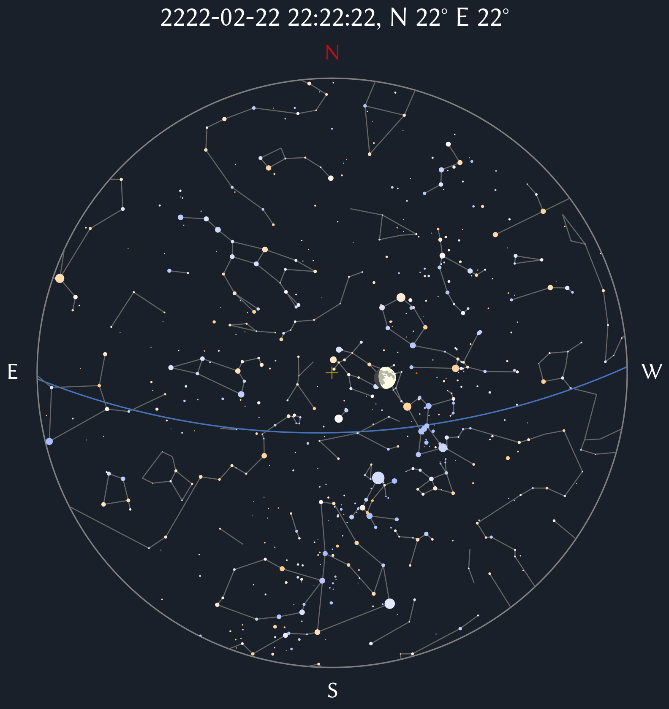

# Simple Atlas

A simple sky chart generator based on [Astropy's](https://github.com/astropy/astropy) ephemeris functions.

Star data: [Anderson, E. & Francis, C., 2013, VizieR Online Data Catalog, V/137D
](https://cdsarc.cds.unistra.fr/viz-bin/cat/V/137D)

Constellation lines data: [Stellarium](https://github.com/Stellarium/stellarium/blob/master/skycultures/western/constellationship.fab)

Thanks to [Bersaelor's](https://stackoverflow.com/users/459744/bersaelor) B-V color index to grb color algorithm.
